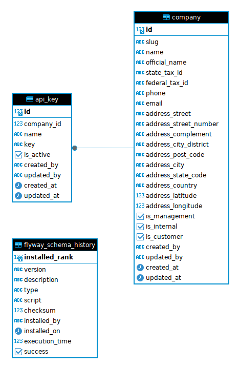
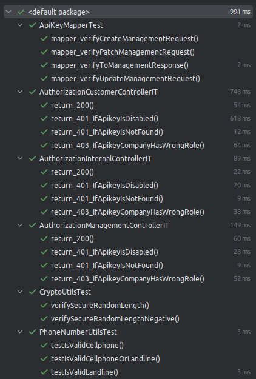
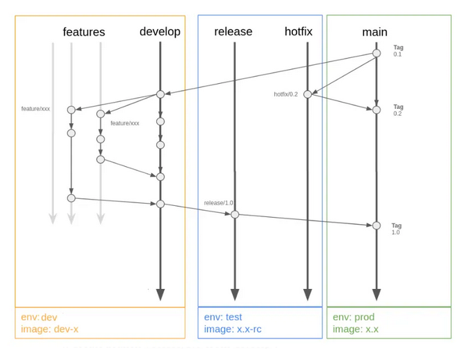
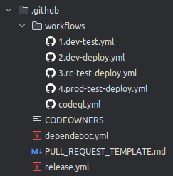
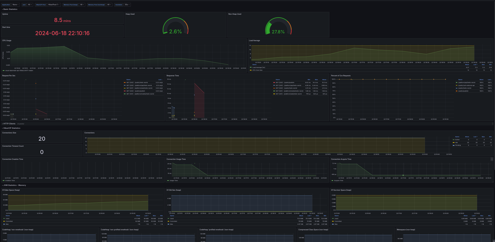
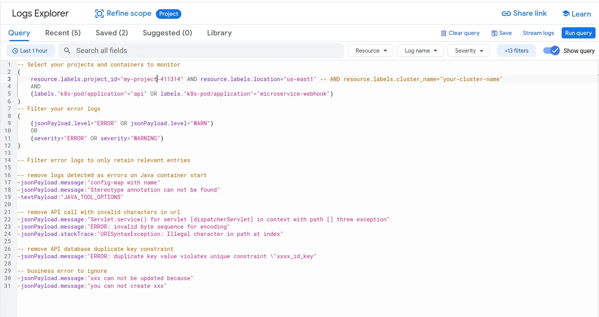
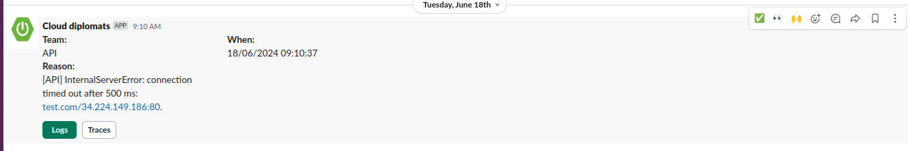
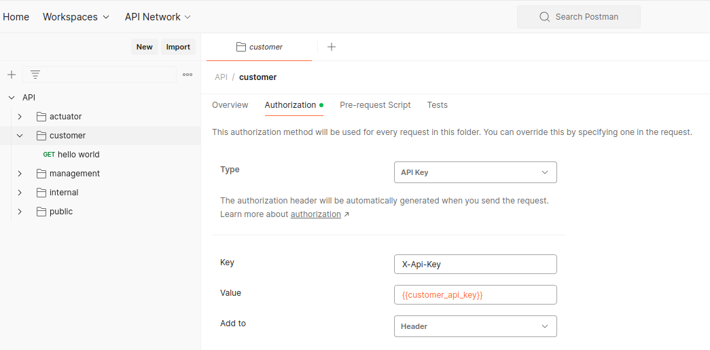
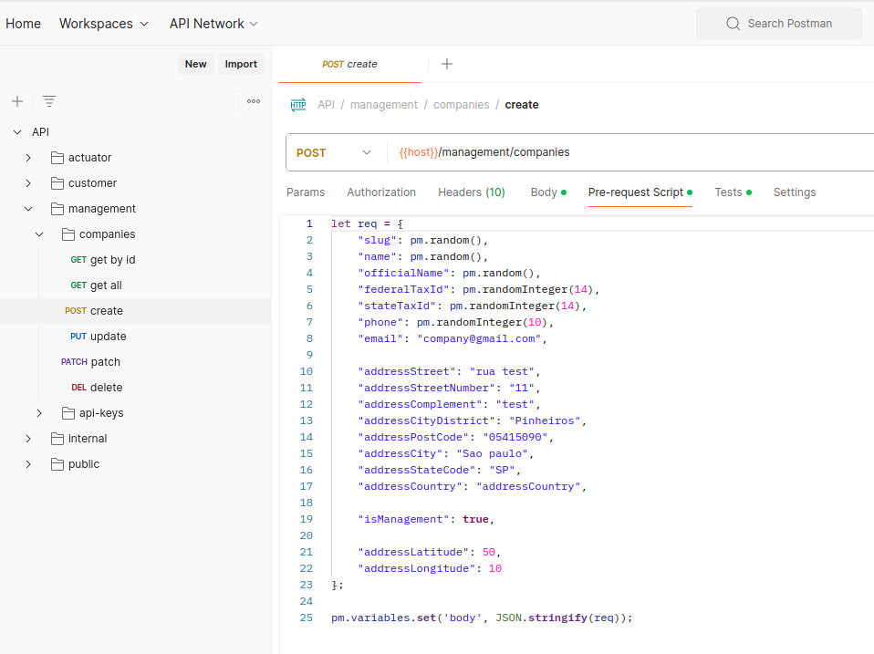
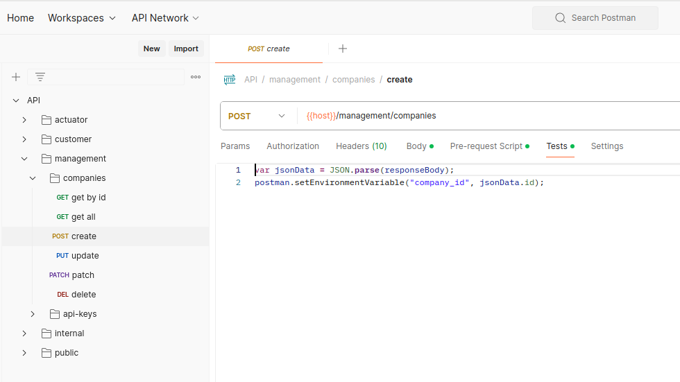

# Project assignment

## Introduction

Welcome to the API Documentation for the project assignment xxxx. This API was designed with a
strong emphasis on security and performance, strictly following industry best practices. It consists
of four distinct APIs, each serving a specific purpose

- **Customer**: Facilitates customer integration with the platform.
- **Management**: API reserved for the development team to manage the platform. It is isolated from
  internal APIs to enhance security.
- **Internal**: Enables interaction with external services such as schedulers, jobs, and webhooks,
  ensuring adequate external integration.
- **Public API**: Serves data accessible to the public.

## Table of Contents

- [Project structure](#project-structure)
    - [Controllers](#controllers)
    - [Services](#services)
- [Database](#database)
    - [Schema](#schema)
        - [Definition](#definition)
        - [Technical choices](#technical-choices)
        - [Business choices](#business-choices)
    - [Indexes](#indexes)
    - [ORM](#orm)
    - [Migration](#migration)
    - [Initial data dump](#initial-data-dump)
- [API Endpoints](#api-endpoints)
    - [Customer](#customer)
    - [Internal](#internal)
    - [Management](#management)
    - [Public](#public)
- [API definitions and specific implementations](#api-definitions-and-specific-implementations)
    - [General](#general)
    - [Feature optimization](#feature-optimization)
        - [Validation](#validation)
        - [Implementation](#implementation)
- [Authentication and Authorization](#authentication-and-authorization)
- [Exception handling](#exception-handling)
- [Infra](#infra)
    - [Caching](#caching)
    - [Image building](#image-building)
    - [JVM options](#jvm-options)
- [Observability](#observability)
    - [Metrics](#metrics)
    - [Tracing](#tracings)
    - [Logging](#logging)
    - [Log strategy](#log-strategy)
    - [Profiling](#profiling)
- [Unit and Integration Tests](#unit--integration-tests)
    - [Strategy](#strategy)
    - [Application tests](#application-tests)
- [CI/CD](#cicd)
    - [Git Workflow](#git-workflow)
    - [Release workflow](#release-workflow)
    - [Hotfix workflow](#hotfix-workflow)
    - [Branching Strategy](#branching-strategy)
    - [Continuous Deployment](#continuous-deployment)
        - [Strategy](#strategy-1)
        - [Deployment](#deployment)
    - [Areas for Improvement](#areas-for-improvement)
- [GitHub Actions configuration](#github-actions-configuration)
    - [Branch: develop](#branch-develop)
    - [Branch: main](#branch-main)
    - [Github environments](#github-environments)
    - [Release application](#release-application)
- [Production recommendations](#production-recommendations)
    - [Monitoring](#monitoring)
    - [Logging](#logging-1)
    - [Alerting](#alerting)
    - [High Availability (HA)](#high-availability-ha)
    - [Database](#database-1)
    - [Security](#security)
- [Formatting](#formatting)
- [Postman collection](#postman-collection)
- [Running the project](#running-the-project)
    - [Dependencies](#dependencies)
    - [Run project](#run-project)
    - [Debug project](#debug-project)
    - [Test project](#test-project)
    - [Clean project](#clean-project)

## Project structure

The project hierarchy adheres to standard Java package conventions, organized by package type.
Personally, I find it challenging to begin with a fully modular approach, as initially, you may not
have a complete understanding of the application. I like to start with a simple structure and then
iteratively refine and adapt it as my comprehension of the domain and context deepens. The
controllers, requests, and responses are organized on a per-product basis to enhance code separation
and security:

```
├── src
│   ├── main
│   │   ├── java
│   │   │   └── com
│   │   │       └── project
│   │   │           └── api
│   │   │               ├── clients
│   │   │               │   └── slack
│   │   │               ├── constants
│   │   │               ├── controllers
│   │   │               │   ├── customer
│   │   │               │   ├── internal
│   │   │               │   ├── management
│   │   │               │   │   └── base
│   │   │               │   └── pubic
│   │   │               ├── entities
│   │   │               │   └── base
│   │   │               ├── exceptions
│   │   │               │   └── types
│   │   │               ├── facades
│   │   │               ├── infra
│   │   │               │   ├── auditors
│   │   │               │   ├── auth
│   │   │               │   ├── cache
│   │   │               │   ├── filters
│   │   │               │   ├── monitoring
│   │   │               │   └── security
│   │   │               ├── listeners
│   │   │               ├── mappers
│   │   │               │   └── base
│   │   │               ├── repositories
│   │   │               ├── requests
│   │   │               │   ├── customer
│   │   │               │   └── management
│   │   │               ├── responses
│   │   │               │   ├── customer
│   │   │               │   ├── management
│   │   │               │   └── shared
│   │   │               ├── services
│   │   │               │   └── base
│   │   │               ├── utils
│   │   │               └── validators
```

### Controllers

The controllers conform to a strict naming convention, beginning with the controller’s name and
extending to the last folder in the hierarchy. They all follow the same structure:

```java

@Slf4j
@RestController
@RequestMapping(CustomerController.BASE_URL)
@RequiredArgsConstructor
public class CustomerController {

  public static final String BASE_URL = AppUrls.CUSTOMER_API;
}
```

They retrieve their respective URLs from a centralized configuration class. It's crucial to maintain
consistent and immutable URL definitions, especially for endpoints involving authorization
mechanisms, as any modifications could inadvertently impact access control and security.

### Services

They all follow the same structure:

```java

@Slf4j
@Transactional(readOnly = true)
@Service
@RequiredArgsConstructor
public class CompanyService extends BaseService<Company> {

  @Getter
  private final CompanyRepository repository;
}
```

It is configured to set all transactions as read-only by default, which can improve performance by
leveraging database optimizations for read-only operations. It inherits from a `BaseService` class
that encapsulates commonly used functions, promoting code reuse and maintainability.

While it's a matter of personal preference, I tend to encapsulate most business rules within the
Controller layer. This approach aims to keep the service layer more generic and reusable across
different use cases, while also minimizing the transaction scope and potential contention. When
implemented thoughtfully, I have found it to be more reliable and efficient to keep my code DRY.

## Database

It uses PostgreSQL for persistence and Flyway for managing migrations and schema versioning.

### Schema

#### Definition

The database consists of 3 tables (including 1 for migration):

- **company**: Represents organizations using the platform.
- **api_key**: Used by companies to integrate with the platform.



#### Technical choices

- Always use `identity` for the primary key (instead of `bigserial`) for tables that do not require batching.
- Normalize all identities to use `bigint`.
- Use [UUIDv7](https://uuid7.com/) for tables that require batching to enhance performance. They are
  generated client-side because PostgreSQL does not currently implement it as of version 17 (planned for v18). 
  UUIDv7 is optimized for indexing and querying (as opposed to UUIDv4), as explained [here](https://www.cybertec-postgresql.com/en/unexpected-downsides-of-uuid-keys-in-postgresql/).
- If you must use identity, opt for a traditional sequence generator. However, be aware that this will limit your batching configuration flexibility.
- Normalize `varchar` lengths to 255.
- All tables are created in the `public` schema.
- By default, all tables include `created_by`, `updated_by`, `created_at`, and `updated_at` columns.
- I did not implement partitioning or sharding strategies in this phase, as they require a deep
  understanding of the system's architecture, data models, and relationships. Without careful
  planning and consideration, it can potentially introduce significant complexity and bottlenecks.
  If the tables start to grow to several billion rows, you might want to reconsider it.

#### Business choices

- This is specific to your home assignment project, add some context or remove it. 
  I personally put all the business/product choice I have made.

### Indexes

I only created x indexes:

- `CREATE INDEX xxxx on x(x);`

I did not want to create too many of them without having a complete overview of the system. I always
try to create **at most 10 indexes** per table, as it will slow down (excluding hot update) create
and update operations.

### ORM

- Hibernate is configured to only perform schema validation to ensure data integrity.
- Hibernate, like many ORMs, does not support batching for entities with identity columns, since IDs
  are assigned at insert time. To overcome this limitation, it uses UUIDv7 for tables that require
  batching.
- Personally, I do not like to use @ManyToOne or @ManyToMany relationships within entities to
  prevent misuse of lazy loading, which can lead to performance issues.
- All transactions are set at the service layer to ensure consistency.
- By default, all service methods are read-only to improve Hibernate performance.

### Migration

- Use Liquibase for automatic schema migration.
- It is **really** important to create and drop indexes of large tables outside of Liquibase
  using `CREATE INDEX CONCURRENTLY` and `DROP INDEX CONCURRENTLY` statements to prevent any locking
  and database downtime.

### Initial data dump

- For the sake of simplicity I added the following entities in the initial migration:

```sql
INSERT INTO company (slug, name, email, is_management, created_at, updated_at)
VALUES ('my-company-management', 'My company mgmt', 'my-company-management@gmail.com', true, NOW(), NOW());
INSERT INTO api_key (company_id, name, key, is_active, created_at, updated_at)
VALUES (1, 'my company management', 'apikey-mgmt', true, NOW(), NOW());

INSERT INTO company (slug, name, email, is_internal, created_at, updated_at)
VALUES ('my-company-internal', 'My company internal', 'my-company-internal@gmail.com', true, NOW(), NOW());
INSERT INTO api_key (company_id, name, key, is_active, created_at, updated_at)
VALUES (2, 'my company internal', 'apikey-internal', true, NOW(), NOW());

INSERT INTO company (slug, name, email, is_customer, created_at, updated_at)
VALUES ('my-first-client', 'My first client', 'my-first-client@gmail.com', true, NOW(), NOW());
INSERT INTO api_key (company_id, name, key, is_active, created_at, updated_at)
VALUES (3, 'apikey My first client', 'apikey-client', true, NOW(), NOW());
```

## API endpoints

### Customer

- **Description:** Client-facing API.
- **Authorization:**: It verifies the API key company's role is `company.is_customer`.
- **URL:**
    - `{{host}}/v1/api`:
        - GET - hello world

### Internal

- **Description:** Expose APIs for external services such as schedulers, jobs, webhooks etc.
- **Authorization:**: It verifies the API key company's role is `company.is_internal`.
- **URL:** `{{host}}/internal`

### Management

- **Description:** API for managing and maintaining the platform.
- **Authorization:**: It verifies the API key company's role is `company.is_management`.
- **URL:**
    - `{{host}}/management/companies`
        - GET - List all companies
        - GET - Get company by id
        - POST - Create company
        - PUT - Update company
        - PATCH - Patch company
        - DELETE - Delete company
    - `{{host}}/management/api-keys`
        - GET - List all api-keys
        - GET - Get api-keys by id
        - POST - Create api-keys
        - DELETE - Inactivate api-keys

### Public

- **URL:** `{{host}}/public`
- **Description:** Provides public facing information.

## API definitions and specific implementations

### General

- API requests/responses only use the necessary information to optimize payload processing and
  network transfer costs.
- The `apikey.key` is always excluded from logs.
- Management APIs use pagination to limit the response payload size.
- The maximum page size is set to 20 to prevent potential memory issues.
- As your entities grow, you might want to reimplement the pagination mechanism to avoid the count
  query in PostgreSQL, as it is very slow on large tables.
- All management APIs are built using a generic `BaseManagementController` that leverages
  sophisticated use of generics. The differences lie in their request and response implementations,
  making it really easy to add any management APIs.

```java

@Getter
@Slf4j
@RestController
@RequestMapping(CompanyManagementController.BASE_URL)
@RequiredArgsConstructor
public class CompanyManagementController
    extends BaseManagementController<
    Company,
    Long,
    CreateCompanyManagementRequest,
    UpdateCompanyManagementRequest,
    PatchCompanyManagementRequest,
    CompanyManagementResponse> {

  public static final String BASE_URL = AppUrls.MANAGEMENT_API + "/companies";

  private final CompanyService service;
  private final CompanyMapper mapper;
}

/**
 * The class Base management controller.
 *
 * @param <E> the type parameter Entity
 * @param <I> the type parameter ID
 * @param <C> the type parameter CreateRequest
 * @param <U> the type parameter UpdateRequest
 * @param <P> the type parameter PatchRequest
 * @param <R> the type parameter Response
 */
@Slf4j
public abstract class BaseManagementController<
    E extends BaseEntity<I>, I extends Serializable, C, U, P, R> {
  public abstract BaseManagementMapper<E, C, U, P, R> getMapper();
  public abstract BaseService<E, I> getService();
}

/**
 * The interface Base mapper management.
 *
 * @param <E> the type parameter Entity
 * @param <C> the type parameter CreateRequest
 * @param <U> the type parameter UpdateRequest
 * @param <P> the type parameter PatchRequest
 * @param <R> the type parameter Response
 */
public interface BaseManagementMapper<E, C, U, P, R> {

  @ToEntity
  E toEntity(C request);

  @ToEntity
  E updateWithManagementRequest(U request, @MappingTarget E entity);

  @ToEntity
  @BeanMapping(nullValuePropertyMappingStrategy = NullValuePropertyMappingStrategy.IGNORE)
  E patchWithManagementRequest(P request, @MappingTarget E entity);

  R toManagementResponse(E entity);
}
```

### Feature optimization

#### Validation

- This is specific to your home assignment project, add some context or remove it. I personally put the request validations and why.

#### Implementation

- This is specific to your home assignment project, add some context or remove it. 
  I personally put the specific implementation that was asked in the project.

## Authentication and Authorization

The application implements an API key-based authentication. It uses Role-Based Access Control (RBAC)
based on company attributes such as 'is_customer', 'is_management', and 'is_internal'. I personally
prefer to repeat this information per table (instead of using satellite table) using boolean
column for better data manipulation and security.

Authorization is verified at the API entry, but the architecture allows RBAC verification at any
level of the application, including individual service methods using the `@hasRole()` annotation.
For enhanced security, the system follows a deny-by-default approach, where all URLs are initially
denied access, and authorization is granted on a case-by-case basis, strictly adhering to the
defined access policies.

```java

@Bean
public SecurityFilterChain securityFilterChain(final HttpSecurity http) throws Exception {

  http.addFilterBefore(
          new ApiKeyAuthenticationFilter(
              AppUrls.MANAGEMENT_API + "/**", this.authenticationManager()),
          AnonymousAuthenticationFilter.class)
      .addFilterBefore(
          new ApiKeyAuthenticationFilter(
              AppUrls.INTERNAL_API + "/**", this.authenticationManager()),
          AnonymousAuthenticationFilter.class)
      .addFilterBefore(
          new ApiKeyAuthenticationFilter(
              AppUrls.CUSTOMER_API + "/**", this.authenticationManager()),
          AnonymousAuthenticationFilter.class)
      .authorizeHttpRequests(
          authorize ->
              authorize
                  // Management API
                  .requestMatchers(AppUrls.MANAGEMENT_API + "/**")
                  .hasAnyRole(UserRoles.MANAGEMENT_API_USER.getRole())

                  // Internal API
                  .requestMatchers(AppUrls.INTERNAL_API + "/**")
                  .hasAnyRole(UserRoles.INTERNAL_API_USER.getRole())

                  // Customer API
                  .requestMatchers(AppUrls.CUSTOMER_API + "/**")
                  .hasAnyRole(UserRoles.CUSTOMER_API_USER.getRole())

                  // Actuator API
                  .requestMatchers("/actuator/**")
                  .permitAll()

                  // Public API
                  .requestMatchers(AppUrls.PUBLIC + "/**")
                  .permitAll()

                  // Authorize global error page.
                  .requestMatchers("/error")
                  .permitAll()

                  // Else deny all request by default.
                  .anyRequest()
                  .denyAll())
      .csrf(AbstractHttpConfigurer::disable)
      .sessionManagement(
          session -> session.sessionCreationPolicy(SessionCreationPolicy.STATELESS))
      .httpBasic(AbstractHttpConfigurer::disable)
      .formLogin(AbstractHttpConfigurer::disable)
      .logout(AbstractHttpConfigurer::disable);

  return http.build();
}
```

For more granular access control, the system can be extended to support Attribute-Based Access
Control (ABAC), providing fine-grained authorization based on a combination of attributes beyond
just roles. However, for simplicity, I limited the implementation to RBAC.

To enhance identity management, I would recommend moving to a centralized identity provider such as
Keycloak or Okta. This approach allows you to focus on creating value for your product instead of
managing identity and access concerns, which typically do not create intrinsic value for your
product.

All authentication interactions are managed by an `AuthFacade`, which simplifies data retrieval and
encapsulates complexity.

## Exception Handling

Exception handling is centralized in the `GlobalExceptionHandler` class to ensure consistent and
normalized error responses. It adheres to the Problem Details for HTTP APIs specification defined
in [RFC 9457](https://www.rfc-editor.org/rfc/rfc9457). I have also overridden the `ErrorAttributes` 
class to normalize exceptions thrown before the Spring MVC context.

All application exceptions extend the `RootException` to provide a normalized error message.

```java

@Getter
public class RootException extends RuntimeException {

  @Serial
  private static final long serialVersionUID = 6378336966214073013L;

  private final HttpStatus httpStatus;
  private final List<ApiErrorDetails> errors = new ArrayList<>();

  public RootException(@NonNull final HttpStatus httpStatus) {
    super();
    this.httpStatus = httpStatus;
  }

  public RootException(@NonNull final HttpStatus httpStatus, final String message) {
    super(message);
    this.httpStatus = httpStatus;
  }
}
```

They are caught inside the `rootException` function in the `GlobalExceptionHandler`:

```java

@ExceptionHandler(RootException.class)
public ResponseEntity<ProblemDetail> rootException(final RootException ex) {
  log.info(ex.getMessage(), ex);

  if (ex.getHttpStatus().is5xxServerError()) {
    this.slack.notify(format("[API] InternalServerError: %s", ex.getMessage()));
  }

  // message can be removed if necessary for security purpose.
  final ProblemDetail problemDetail =
      this.buildProblemDetail(ex.getHttpStatus(), ex.getMessage(), ex.getErrors());
  return ResponseEntity.status(ex.getHttpStatus()).body(problemDetail);
}
```

Example:

```json
{
  "type": "about:blank",
  "title": "Internal Server Error",
  "status": 500,
  "detail": "Something went wrong. Please try again later or enter in contact with our service.",
  "instance": "/v1/api"
}
```

```json
{
  "type": "about:blank",
  "title": "Bad Request",
  "status": 400,
  "detail": "Validation failed.",
  "instance": "/management/companies",
  "errors": [
    {
      "pointer": "slug",
      "reason": "must not be blank"
    }
  ]
}
```

## Infra

### Caching

The application utilizes [Valkey](https://valkey.io/) as a caching provider to enhance performance.
Frequently accessed entities such as Company and ApiKey are cached, reducing the
need for repeated database queries and improving response times. I would recommend deploying at
least two replicas for better availability, as it is a critical dependency.

### Image building

The application utilizes [Buildpack](https://buildpacks.io/) to construct a production-ready image
optimized for runtime efficiency, embedding security best practices and resource-aware container
capabilities.

### JVM options

- The API
  uses [virtual threads](https://docs.oracle.com/en/java/javase/21/core/virtual-threads.html) for
  better scalability.
- The memory configurations are done automatically thanks to buildpack.

## Observability

It uses OpenTelemetry agent to collect detailed metrics and tracing data.

### Metrics

All metrics are generated automatically by the OpenTelemetry agent. To export the metrics
you can set the property `otel.metrics.exporter=otlp` in `opentelemetry/dev.properties` or set
the environment variable `OTEL_METRICS_EXPORTER=otlp` and specify the corresponding OTLP
endpoint in `otel.exporter.otlp.endpoint`.

### Logging

A logback configuration is defined with the following pattern for `json-logs` profile:

```json
{
  "level": "%level",
  "company": "%mdc{company}",
  "user": "%mdc{user}",
  "message": "%message",
  "traceId": "%mdc{trace_id}",
  "spanId": "%mdc{span_id}",
  "traceFlags": "%mdc{trace_flags}",
  "logger": "%logger",
  "thread": "%thread"
}
```

By setting the MDC (Mapped Diagnostic Context) in the request filter `AddCredsToMDCFilter`, we are
able to inject the company slug and user email in every log. The trace_id, span_id, and
trace_flags are provided automatically by the OpenTelemetry agent. For the default log pattern,
it sets the property `logging.pattern.correlation` to `"[${spring.application.name:},%X
{trace_id:-},%X{span_id:-},%X{trace_flags:-}]"`. It assumes that the logs will be picked up
automatically by a daemon set agent, usually present in every node of a Kubernetes cluster or
server.

### Log strategy

- GET requests are logged at the debug level.
- CREATE, UPDATE, and DELETE requests are logged at the info level.
- It logs asynchronously every entity that is created, updated, deleted, or rolled back through
  a `@TransactionalEventListener` to ensure strict traceability of every entity changes.
- As explained previously the company and user information are incorporated into the log context
  for better traceability.
- As explained previously a dedicated profile `json-logs` is available for logging in JSON format,
  facilitating easier integration with log management tools.

Example:

```json
{
  "@timestamp": "2024-06-17T18:44:28.936466065-03:00",
  "level": "INFO",
  "company": "my-management-company",
  "user": "my-management-company@gmail.com",
  "message": "[request] create CreateCompanyManagementRequest[slug=lgdeu9f, name=wfo1bno, officialName=xoi5v6i, federalTaxId=98993450256806, stateTaxId=27902738255513, phone=1397661651, email=company@gmail.com, addressStreet=rua test, addressStreetNumber=11, addressComplement=test, addressCityDistrict=Pinheiros, addressPostCode=05415090, addressCity=Sao paulo, addressStateCode=SP, addressCountry=addressCountry, addressLatitude=50, addressLongitude=10, isManagement=true, isInternal=false, isCustomer=false]",
  "traceId": "e95a913e31679890788fdc6bf8ffce4b",
  "spanId": "eca2a54db44b2fa8",
  "traceFlags": "01",
  "logger": "com.project.api.controllers.management.base.BaseManagementController",
  "thread": "tomcat-handler-1"
}
{
  "@timestamp": "2024-06-17T18:44:28.937314985-03:00",
  "level": "INFO",
  "company": "my-management-company",
  "user": "my-management-company@gmail.com",
  "message": "[creating] company Company{id=null, slug='lgdeu9f', name='wfo1bno', officialName='xoi5v6i', federalTaxId='98993450256806', stateTaxId='27902738255513', phone='1397661651', email='company@gmail.com', addressStreet='rua test', addressStreetNumber='11', addressComplement='test', addressCityDistrict='Pinheiros', addressPostCode='05415090', addressCity='Sao paulo', addressStateCode='SP', addressCountry='addressCountry', addressLatitude=50, addressLongitude=10, isCustomer=false, isManagement=true, isInternal=false, createdBy='null', updatedBy='null', createdAt=null, updatedAt=null}",
  "traceId": "e95a913e31679890788fdc6bf8ffce4b",
  "spanId": "eca2a54db44b2fa8",
  "traceFlags": "01",
  "logger": "com.project.api.services.base.BaseService",
  "thread": "tomcat-handler-1"
}
{
  "@timestamp": "2024-06-17T18:44:28.946102329-03:00",
  "level": "INFO",
  "company": "",
  "user": "",
  "message": "[created] company 5",
  "traceId": "e95a913e31679890788fdc6bf8ffce4b",
  "spanId": "eca2a54db44b2fa8",
  "traceFlags": "01",
  "logger": "com.project.api.listeners.EntityTransactionLogListener",
  "thread": "task-2"
}
```

### Tracings

To export the traces, set the property `otel.traces.exporter=otlp` in `opentelemetry/dev.properties`
or set the environment variable `OTEL_TRACES_EXPORTER=otlp` and specify the
corresponding OTLP endpoint in `otel.exporter.otlp.endpoint`. For debugging purpose you can use the
[OpenTelemetry Desktop Viewer](https://github.com/CtrlSpice/otel-desktop-viewer).

### Profiling

To provide better memory management and debugging,
a [Pyroscope](https://github.com/grafana/pyroscope) agent configuration has been created. You can
activate it by setting the property `pyroscope.enabled` to `true`.

## Unit & Integration Tests

### Strategy

I personally prefer to extensively use integration tests, employing specific techniques outlined
below to thoroughly test the application without compromising test duration. Additionally, unit
tests are executed in parallel to optimize testing duration and overall efficiency.

The application reuses the same execution context across all integration tests to significantly
improve performance. PostgreSQL and Redis instances are shared across test executions, optimizing
resource utilization and reducing the overall testing duration. Additionally, `MockMvc` is
automatically configured for all APIs, simplifying the testing configuration process.

With these optimizations in place, adding a new integration test incurs a relatively low marginal
cost, typically ranging between 5 and 25 milliseconds.

I have found this method to be highly effective for testing the entire application, especially in
logistics, where extensive business rule verification is required.

This approach is implemented by having all integration tests extend `BaseIntegrationTest`.

```java

@ActiveProfiles("test")
@AutoConfigureMockMvc
@TestInstance(Lifecycle.PER_CLASS)
@SpringBootTest(webEnvironment = SpringBootTest.WebEnvironment.RANDOM_PORT)
public abstract class BaseIntegrationTest {

  private static final ObjectMapper defaultObjectMapper =
      new ObjectMapper()
          .configure(DeserializationFeature.FAIL_ON_UNKNOWN_PROPERTIES, false)
          .setPropertyNamingStrategy(LOWER_CAMEL_CASE)
          .registerModule(new JavaTimeModule());

  @Container
  @ServiceConnection
  public static PostgreSQLContainer<?> postgres = new PostgreSQLContainer<>("postgres:16-alpine");

  @Container
  static RedisContainer redis =
      new RedisContainer(parse("bitnami/valkey:7.2"))
          .withEnv(Map.of("VALKEY_PASSWORD", "password"));

  static {
    Startables.deepStart(postgres, redis).join();
  }

  @Autowired
  public MockMvc mockMvc;

  @DynamicPropertySource
  static void applicationProperties(final DynamicPropertyRegistry registry) {
    registry.add("redis.port", () -> redis.getMappedPort(6379));
  }

}
```

### Application tests

The api implements the following unit and integration tests:



They mostly focus on:

- Authentication and authorization for every APIs

With more time I would have created many more tests to improve test coverage.

## CI/CD

### Git Workflow

I opted for a conservative approach using Gitflow due to limited context. Depending on the
product development context, I would recommend using a trunk-based
workflow for more streamlined development.



### Release workflow

It is implemented to prevent manual intervention and interact solely with pull requests, mitigating
potential bugs.

**Development environment - Feature Development**

- Create `feature/xxxx` branch from `develop`.
- Open a pull request from `feature/xxxx` into `develop`.
    - The CI will automatically:
        - Run all tests.
- Merge and close the PR:
    - The CI will automatically:
        - Run all tests.
        - Deploy image to dev image registry using workload identity federation.

Repeat steps 1, 2, and 3 as necessary during feature development iterations.

**Testing/Staging environment - Release Candidate**

- From `develop` branch:
  ```bash
  make release
  ```
    - It will automatically calculate the release number and open the PR from `release/x.x`
      to `main`.
    - The CI will automatically:
        - Run all tests.
        - Deploy image to test image registry using workload identity federation.

**Production environment**

- Merge and close the PR `release/x.x` into `main`.
    - The CI will automatically:
        - Run all tests.
        - Deploy image to prod image registry using workload identity federation.
        - Create release.
        - Open PR to align `develop` with `main` in case modifications were made in the PR.

### Hotfix workflow

**Testing/Staging environment - Release Candidate**

- From `main` branch:
  ```bash
  make hotfix
  ```
    - It will automatically calculate the release number and open the PR from `release/x.x`
      to `main`.
    - The CI will automatically:
        - Run all tests.
        - Deploy image to test image registry.

**Production environment**

- Merge and close the PR `release/x.x` into `main`.
    - The CI will automatically:
        - Run all tests.
        - Deploy image to prod image registry using workload identity federation.
        - Create release.
        - Open PR to align `develop` with `main` since `develop` do not have the hotfix
          modification.

You can have a look at their implementations:



### Branching Strategy

This workflow involves managing five types of branches:

- **Long-lived branches:**
    - `main`: Always reflects the production state.
    - `develop`: Always mirrors the state with the latest development changes for the upcoming
      release.

- **Short-lived branches:**
    - `feature/*`: Branches off from `develop` for developing new features.
    - `release/*`: Branches off from `develop` when a set of features is ready for deployment
      to `main`.
    - `hotfix/*`: Branches off from `main` for quick fixes that need immediate deployment to `main`.

### Continuous Deployment

#### Strategy

I personally prefer to limit the CI pipeline to tests and push image to registry. This
workflow expects an external continuous deployment agent such
as [ArgoCD](https://argoproj.github.io/cd/) paired
with [ArgoCD Image Updater](https://argoproj.github.io/cd/) (or [Kargo](https://github.com/akuity/kargo)) to automatically deploy the new image.

This approach ensures that the CI pipeline focuses solely on:

- Running tests of any kind, static code analyse, security measures [...].
- Creating and pushing the Docker image to a registry.

#### Deployment

After the new image has been automatically picked up, there are several deployment strategies you
can consider:

**Blue-Green Deployment**: This approach ensures zero downtime by running two identical
production environments ("blue" and "green"). Traffic is routed to one environment while the
other is updated. Use a `preStop` hook in your kubernetes deployment like `command: ['sleep', '60']` for the kubelet 
to wait for a specified delay before sending the `SIGTERM` signal, ensuring graceful shutdown.

**Canary Deployment**: This strategy involves rolling out the new version to a subset of users or
servers to reduce risk. It can be done manually or automatically based on predefined metrics.
Automatic canary deployment can be quite tricky as it requires knowing adequate metrics to observe
performance and stability.

**Feature Flags**: This approach involves using conditional logic in the code to control feature
availability. It allows for gradual rollout of new features but can add complexity to the
codebase.

### Areas for Improvement

- **Performance Testing**:  Create an additional workflow to integrate [k6s](https://k6.io/) for
  critical APIs to ensure no performance regression are made.
- **Code quality and security**:
  Use [SonarQube](https://www.google.com/url?sa=t&source=web&rct=j&opi=89978449&url=https://www.sonarsource.com/products/sonarqube/&ved=2ahUKEwjRloDCyeWGAxVWq5UCHd3qCCsQFnoECAYQAQ&usg=AOvVaw2XrcT14PuYVcMxUcEkqccE)
  to enhance code quality and security.
- **Automated release candidate testing**: Create an additional workflow to automatically test
  release candidates in your test environment. Trigger a webhook after a successful
  application deployment (using argo-notification for example), which will initiate a GitHub Action
  workflow to execute an end-to-end (e2e) tests.

## GitHub Actions configuration

### Branch: develop

- **Restrict deletions**: Prevent `develop` branch deletion.
- **Restrict PR before merging**: Require all pull requests to be up-to-date before merging into
  `develop`.
- **Require status check**: Ensure the `dev-test` workflow passes before allowing merges into
  develop.
- **Block force push**: Prevent force pushes to the `develop` branch.

### Branch: main

- **Restrict deletions**: Prevent `main` branch deletion.
- **Restrict PR before merging**: Require all pull requests to be up-to-date before merging into
  `main`.
- **Require status checks**: Ensure both `rc-test` and `rc-deploy` workflows pass before allowing
  merges into `main`.
- **Block force push**: Prevent force pushes to the `main` branch.

### Github environments

Three environments dev, test and prod have been created to isolate workflow variables and ensure
controlled deployment.

### Release application

The GitHub release is automatically executed via a dedicated GitHub App (`jojoooo1-app`) to
enhance security and prevent the use of personal access tokens.

## Production recommendations

### Monitoring

- Use an OpenTelemetry [Collector](https://opentelemetry.io/docs/collector/) to consolidate all
  your metrics and traces. It will help you stay vendor agnostics.
- Use a Grafana dashboard like the one shown below to monitor your application:



- This dashboard will help you detect anomalies, bottlenecks, and other issues by providing insights
  into API response times, connection pooling, CPU and memory usage, request volumes, and more.
- Aim to keep all your API requests below 20/25ms to ensure adequate scaling.
- Try to keep all your database operations below 1ms. Utilize tools
  like [pg_stat_statements](https://www.postgresql.org/docs/current/pgstatstatements.html) or Cloud
  SQL [query insights](https://cloud.google.com/sql/docs/postgres/using-query-insights) for
  diagnosing your slowest queries easily. Exclude queries from background jobs, as they typically
  run slower.

### Logging

- Monitor your warning and error logs daily to proactively detect API errors. Here's an example
  that I like to use:



### Alerting

- The application integrates a Slack client that alerts on all internal errors, providing error
  messages with links to search your tracing and logging systems with the corresponding `trace_id`.
  This two links significantly reduces debugging time.



- Automate monitoring using alerting rules. I usually like to begin with the following setup:

```yaml
        - alert: ContainerHighCpuUtilization
          expr: (sum(rate(container_cpu_usage_seconds_total{container!=""}[5m])) by (pod, container) / sum(container_spec_cpu_quota{container!=""}/container_spec_cpu_period{container!=""}) by (pod, container) * 100) > 80
          for: 2m
          labels:
            severity: warning
          annotations:
            summary: "Container High CPU utilization in pod {{ $labels.pod }}"
            description: "Container CPU utilization is above 80%\n VALUE = {{ $value }}"
        
        - alert: ContainerHighMemoryUsage
          expr: (sum(container_memory_working_set_bytes{name!=""}) BY (instance, name) / sum(container_spec_memory_limit_bytes > 0) BY (instance, name) * 100) > 80
          for: 2m
          labels:
            severity: warning
          annotations:
            summary: "Container High Memory usage in pod {{ $labels.pod }}"
            description: "Container Memory usage is above 80%\n  VALUE = {{ $value }}"
        
        - alert: ContainerVolumeUsage
          expr: (1 - (sum(container_fs_inodes_free{name!=""}) BY (instance) / sum(container_fs_inodes_total) BY (instance))) * 100 > 80
          for: 5m
          labels:
            severity: warning
          annotations:
            summary: "Container High Volume usage in pod {{ $labels.pod }}"
            description: "Container Volume usage is above 80%\n  VALUE = {{ $value }}"
        
        
        - alert: ContainerHighThrottleRate
          expr: sum(increase(container_cpu_cfs_throttled_periods_total{container!=""}[5m])) by (container, pod, namespace) / sum(increase(container_cpu_cfs_periods_total[5m])) by (container, pod, namespace) > ( 25 / 100 )
          for: 5m
          labels:
            severity: info
          annotations:
            description: "Container high throttle rate in pod {{ $labels.pod }}."
            summary: "Container is being throttled\n  VALUE = {{ $value }}"
            runbook_url: https://runbooks.prometheus-operator.dev/runbooks/kubernetes/cputhrottlinghigh
        
        - alert: JvmMemoryFillingUp
          expr: (sum by (instance)(jvm_memory_used_bytes{area="heap"}) / sum by (instance)(jvm_memory_max_bytes{area="heap"})) * 100 > 80
          for: 2m
          labels:
            severity: warning
          annotations:
            summary: "JVM memory filling up (pod {{ $labels.pod }})"
            description: "JVM memory is filling up (> 80%) VALUE = {{ $value }}"
        
        # Probably indicate some long-running queries that need to be killed, or it could degrade your system.
        - alert: PostgresqlTooManyDeadTuples
          expr: "pg_stat_user_tables_n_dead_tup > 150000"
          for: 5m
          labels:
            severity: warning
          annotations:
            summary: 'Postgresql too many dead tuples for table "{{ $labels.schemaname }}.{{ $labels.relname }}"'
            description: 'PostgreSQL dead tuples is too large VALUE = {{ $value }}'
        
        # Your Change Data Capture (CDC) system might have encountered an exception, causing the replication process to stop. 
        # Be very careful as your disk size can grow indefinitely.
        # Usually it is pretty bad as you can not decrease your disk size after cleaning the WAL and you will pay an extra fee for disk size you do not use
        - alert: PostgresqlUnusedReplicationSlot
          expr: 'pg_replication_slots_active{slot_name!~".*bigquery.*"} == 0'
          for: 5m
          labels:
            severity: warning
          annotations:
            summary: 'Postgresql unused replication slot "{{ $labels.slot_name }}"'
            description: 'Unused Replication Slots VALUE = {{ $value }}'
```

In that case, you will need a
PostgreSQL [exporter](https://github.com/prometheus-community/postgres_exporter) to translate
PostgreSQL metrics into Prometheus metrics.

Also add some additional performance rules like the following:

```yaml
        - alert: ApiCreateCompanyExceeds40ms
          expr: irate(http_server_requests_seconds_sum{application="api", uri="/api/v1/management/companies", exception="None"}[10m]) / irate(http_server_requests_seconds_count{application="api", uri="/api/v1/management/companies", exception="None" }[ 10m ]) > 0.040
          for: 10m
          labels:
            severity: warning
          annotations:
            summary: "Company API seems too slow in pod '{{ $labels.pod }}'"
            description: 'response time is too high {{ $value | printf "%.2f" }}ms'
        
        - alert: ApiSuccessRateBelow90Percent
          expr: sum by(uri) (http_server_requests_seconds_count{status=~"2.*"}) / sum by(uri) (http_server_requests_seconds_count{}) < 0.90
          for: 5m
          labels:
            severity: warning
          annotations:
            summary: "Api '{{ $labels.uri }}' success rate is below 90% for the past 5min"
            description: 'success rate is {{ $value | printf "%.2f" }}'
```

Eventually, create a runbook to guide your operations team in handling errors. While this example is
generic, as your application matures, develop more detailed guidelines to mitigate service
disruptions. Continuously adjust your dashboard and alert thresholds to avoid alert fatigue.

### High Availability (HA)

Ensure high availability with:

- **Replicas**: Maintain a minimum of 2 replicas.
- **Autoscaling**: Implement autoscaling based on CPU and memory metrics (or other) to efficiently
  handle varying workload demands.
- **Anti-Affinity**: Create an anti-affinity rule to distribute replicas across different nodes
  or zones, improving fault tolerance.
- **PodDisruptionBudget**: Create a `PodDisruptionBudget` with at least 2 replicas to prevent
  issue or failure during kubernetes operations.
- **Database**: Implement a fallback strategy in another region to mitigate risks and
  ensure continuous availability in case of regional failures.
- **Cache**: Same as database to ensure availability during regional issues or failures.

### Database

- Use [pgTune](https://pgtune.leopard.in.ua/) for initial PostgreSQL configuration.
- Set autovacuum thresholds to 5000/10000 for highly updatable tables to optimize vacuum operation
  and table performance. For example:
  ```sql
  ALTER TABLE stop SET (
    autovacuum_vacuum_scale_factor = 0.0,
    autovacuum_vacuum_threshold = 5000,
    autovacuum_analyze_scale_factor = 0.0,
    autovacuum_analyze_threshold = 5000
  );
  ```
- Consider adjusting `autovacuum_vacuum_cost_delay`, `autovacuum_work_mem`,
  and `maintenance_work_mem` settings to improve vacuum performance.
- The API uses HikariCP for efficient database connection management. If
  your database connections start to grow, consider using a centralized solution
  like [PgBouncer](https://github.com/pgbouncer/pgbouncer).
- The API initial pool size is set to 20 connections, keep it as low as possible for better
  performance.
- Always prefer partial indexes.
- Avoid using `order by` on none indexed column
- Avoid sharding or partitioning unless absolutely necessary. It can introduce
  significant complexity and overhead if not implemented carefully.
- Create a read replica for offloading analytical queries or business intelligence workloads, as
  this can help maintain performance for the primary database. If the read replica becomes a
  bottleneck, consider replicating data to an OLAP database
  like [ClickHouse](https://clickhouse.com/) using CDC.
- Monitor replication status to avoid WAL logs to accumulate leading to **unlimited** disk grow.

### Security

To enhance security, consider implementing the following measures:

- **CORS Configuration**: Although no specific CORS configuration is applied, ensure CORS policies
  align with API security requirements.
- **IP Whitelisting**: Restrict access by whitelisting client IP addresses.
- **Rate Limiting**: Implement rate limiting to protect against excessive API requests.
- **Web Application Firewall (WAF)**: Use a WAF to filter and monitor HTTP traffic.
- **Namespace Traffic Restriction**: Enhance isolation by restricting traffic within same kubernetes
  namespaces.
- **Image User Privileges**: Always run image as non-root user `1000` to prevent privilege
  escalation.
- **Cloud SQL Proxy**: Use Cloud SQL Proxy to ensure secure connections to your Cloud SQL instances.
- **API Exposure**: Only expose APIs through a load balancer to control and monitor incoming traffic
  effectively.
- **Actuator Port**: Avoid exposing the Actuator port externally; limit access to serviceMonitor
  only.
- **Secret Management**: Retrieve secrets securely from Vault using a secret operator.
- **Service Accounts with Workload Identity**: Always utilize service accounts with workload
  identity for secure access control.
- **Supply Chain Security**: The API implements an SBOM endpoint at `/actuator/sbom/application` to
  analyze supply chain vulnerabilities.
- **Code Quality** Use a tools for code quality and static analysis like SonarQube
- **Deployment**: Use secure kubernetes deployment as follows:

```yaml
    spec:
      containers:
        - name: api
          image: "<your-image-registry>"
          ports:
            - name: container-port
              containerPort: 8080
            - name: metrics
              containerPort: 8081
          
          readinessProbe:
            initialDelaySeconds: 15
            periodSeconds: 10
            httpGet:
              path: /actuator/health/readiness
              port: metrics
          livenessProbe:
            httpGet:
              path: /actuator/health/liveness
              port: metrics
            initialDelaySeconds: 15
            periodSeconds: 10
          
          lifecycle:
            preStop:
              exec:
                command:
                  - sleep
                  - 10
          
          # Uses adequate requests resources. Always set requests equal to limits and do not set 
          # CPU limit on important deployments to prevent CPU throttling.
          resources:
            requests:
              memory: 768Mi
              cpu: 500m
            limits:
              memory: 768Mi
          
          # Tighten security context
          securityContext:
            readOnlyRootFilesystem: true
            allowPrivilegeEscalation: false
            capabilities:
              drop:
                - ALL
            runAsNonRoot: true
            runAsUser: 1000
          
          volumeMounts:
            - name: tmp-volume
              mountPath: /tmp
      
      # Necessary for readOnly system
      volumes:
        - name: tmp-volume
          emptyDir: { }    
```

## Formatting

It uses [Git Code Format Maven Plugin](https://github.com/Cosium/git-code-format-maven-plugin)
to unify java formatting. On commit, the hook will automatically format staged files.

## Postman Collection

Import Postman collection to quickly get started.

API collection:

[](https://github.com/Jojoooo1/project-assignment/tree/develop/postman/API.postman_collection.json)

Dev environment:

[](https://github.com/Jojoooo1/project-assignment/tree/develop/postman/dev.postman_environment.json)

Authentication is configured in their respective parent folders to prevent redundancy:


Requests that require random values are handled through pre-request scripts:


Variables used in the URL are automatically set after a successful response:



## Running the project

### Dependencies

The dependencies of the project are:

* OpenJDK Java version >= 21
* [Docker](https://www.docker.com)
* [Docker Compose](https://docs.docker.com/compose/)
* [Maven](https://maven.apache.org/)

### Run project

```bash
make start-all
```

The command above may encounter Docker permission issues with project volume directories, in case
you face similar problems like the error below:

> *[ERROR] Failed to execute goal org.apache.maven.plugins:maven-clean-plugin:3.2.0:clean (
default-clean) on project api: Failed to clean project: Failed to delete*

Apply permissions to the project directory like this:

```bash
sudo chmod a+rwx -R ~/repos-dir/api 
```

This command grants read, write, and execute permissions (rwx) to all users (a) recursively (-R) for
the directory `~/repos-dir/api`. Adjust the path (`~/repos-dir/api`) to
match your specific project directory.

### Debug project

Start the infra dependencies:

```bash
make start-infra
```

And run the project by using Intellij (do not forget to set SPRING_PROFILES_ACTIVE=dev) or mvn
directly:

```bash
make run-api
```

### Test project

```bash
make test
```

### Clean project

```bash
make kill
```

